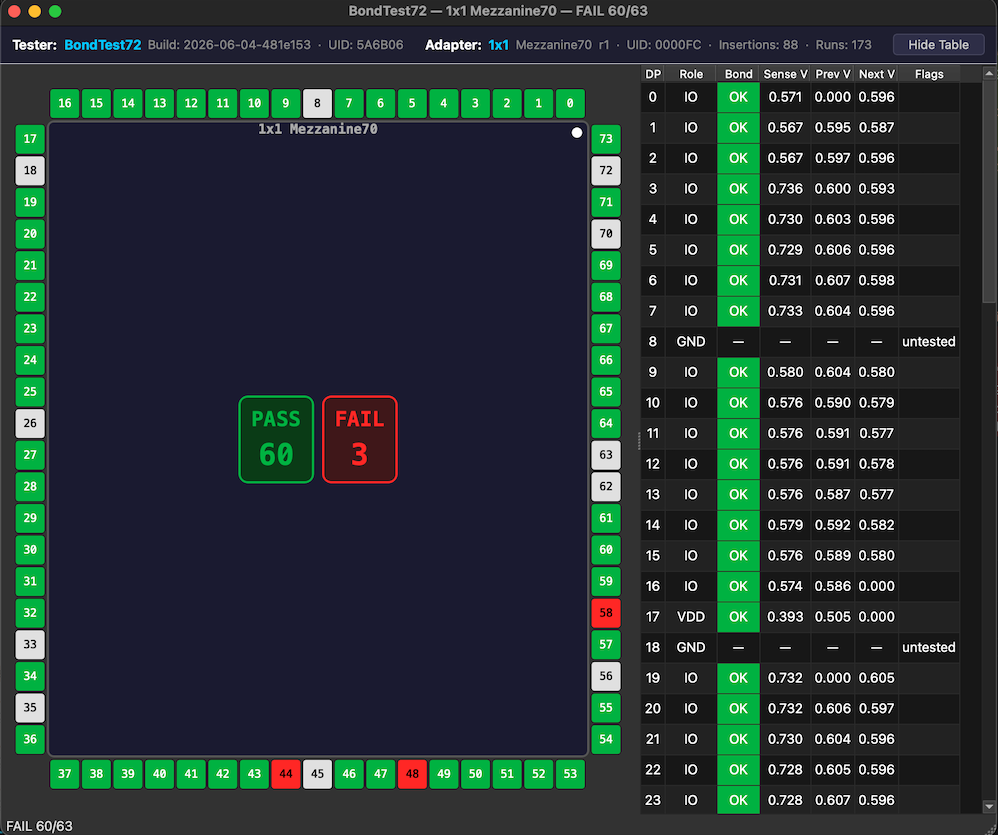

# BondTest72 Tools

All scripts use [uv](https://github.com/astral-sh/uv) for dependency management and can be run directly without a manual `pip install` step.

## Prerequisites

Install `uv` if you don't have it:

```sh
curl -LsSf https://astral.sh/uv/install.sh | sh
```

---

## live_serial_viewer.py

Real-time die map GUI that reads from a serial port. Pads light up as PAD results arrive; the results table updates incrementally. The active adapter and pad map are auto-detected from the tester.



```sh
uv run tools/live_serial_viewer.py --port /dev/tty.usbmodem1101
uv run tools/live_serial_viewer.py --port COM3 --baud 115200
```

| Flag | Default | Description |
|------|---------|-------------|
| `--port` | *(required)* | Serial port |
| `--baud` | `115200` | Baud rate |
| `--padmap` | auto | Override pad map ID (1–6); normally detected from the adapter |

---

## die_visualizer (package)

Offline die map viewer. Reads a saved protocol log file and renders the bond results.

```sh
uv run tools/die_visualizer --file path/to/log.txt
uv run tools/die_visualizer --file path/to/log.txt --padmap 3
```

| Flag | Default | Description |
|------|---------|-------------|
| `--file` | *(required)* | Protocol log file to visualize |
| `--padmap` | `2` | Pad map ID (1 = 1×1 v1, 2 = 1×1 v2, 3 = 1×0.5, 4 = MOSB, 5 = 0.5×1, 6 = TQVA) |

---

## provision.py

Writes the adapter EEPROM: sets hardware ID, pad map ID, and manufacture date. Queries the current adapter state first and asks for confirmation before writing.

```sh
uv run tools/provision.py --port /dev/tty.usbmodem1101 --hw 1 --padmap 2
uv run tools/provision.py --port COM3 --hw 1 --padmap 3 --date 20260601 --yes
```

| Flag | Default | Description |
|------|---------|-------------|
| `--port` | *(required)* | Serial port |
| `--baud` | `115200` | Baud rate |
| `--hw` | *(required)* | Hardware ID (1 = Mezzanine70) |
| `--padmap` | *(required)* | Pad map IDs, comma-separated (1 = Mezzanine70 COB v1, 2 = Mezzanine70 COB v2, 3 = Mezzanine70 COB v1 1×0.5, 4 = MOSB, 5 = Mezzanine70 0.5×1, 6 = TQVA) |
| `--lifespan` | `100` | Max insertions before EOL |
| `--date` | today | Manufacture date in `YYYYMMDD` format |
| `--yes` / `-y` | `false` | Skip confirmation prompt |
